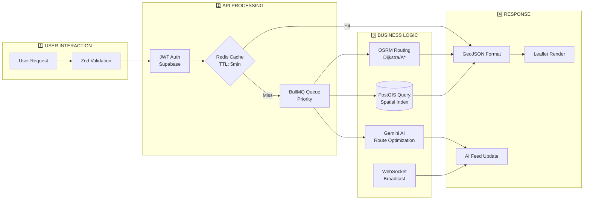

<div align="center">

# ⚡ AetherLog Logistics OS
### *India's AI-Driven Multimodal Command Center*

[](https://aetherlog-five.vercel.app)
[](https://aetherlog-backend-2.onrender.com)
[](https://ai.google.dev/)
[](https://supabase.com)

> 🏆 **Submitted for Google Cloud x PM Gati Shakti Hackathon 2025**

**AetherLog** is a high-fidelity Digital Twin and AI-powered command center for India's logistics ecosystem. It bridges the gap between road and rail networks, offering real-time predictive risk intelligence and multimodal route optimization — fully aligned with the **PM Gati Shakti National Master Plan**.

</div>

---

## 🎯 The Problem

India's logistics sector accounts for **14% of GDP** — one of the highest costs in the world. The root causes:

- 📦 Fragmented road and rail operations with no unified visibility
- ⚠️ Reactive disruption management (floods, landslides, traffic) instead of predictive
- 🌍 No automated ESG / CO2 tracking for freight sustainability
- 🗺️ Lack of Gati Shakti-aligned multimodal pivoting tools for operators
- 🔐 No enterprise-grade, multi-tenant platform for fleet isolation

---

## 💡 The Solution

AetherLog provides a **Unified Logistics Intelligence OS** that enables:

- Real-time fleet simulation on a live map of India
- AI-powered rerouting with automatic **Road → Rail transshipment pivots**
- Multi-tenant data isolation (each logistics firm sees only its own data)
- End-to-end ESG impact tracking per route optimization

---

## 🖥️ Live Demo Preview

| Feature | Preview |
|---|---|
| 🗺️ **Real-time Fleet Map** | Live truck tracking with OSRM road geometry |
| 📡 **Disruption Feed** | AI-generated risk briefs for every impacted truck |
| 🚂 **Rail Network View** | Gati Shakti corridor visualization with hub pivots |
| 🤖 **AI Route Intelligence** | Natural-language briefings powered by Google Gemini |
| 🎯 **Hackathon Demo Presets** | 5 fixed routes (On-Track, At Risk, Critical) for instant demo |

---

## 🚀 Key Features

### 1. 🤖 Triple-Layer AI Resilience
AetherLog never goes dark. We built a **3-tier AI failover system**:

```
Request → Google Gemma 4 (OpenRouter) [PRIMARY]
       → GPT-OSS 120B (OpenRouter)   [SECONDARY FALLBACK]
       → Google Gemini 1.5 Flash     [ULTIMATE BACKUP]
       → Static fallback message     [LAST RESORT]
```

This ensures our AI-driven risk analysis is available 24/7 even during API outages.

### 2. 🗺️ PM Gati Shakti Multimodal Intelligence
When a road shipment is flagged **Critical**, the AI:
1. Identifies the nearest **Gati Shakti Rail Hub** within 600km
2. Calculates 3 alternative transshipment options
3. Computes **Time Saved**, **Cost Reduction**, and **CO2 Avoided** for each
4. Ranks options and highlights the AI-recommended best route

### 3. 🧭 Geographic Routing Intelligence
- **100+ Indian cities** supported via a local geocoding dictionary
- **Bangladesh Avoidance Logic:** Automatically forces waypoints through the **Siliguri Corridor (Chicken's Neck)** for North-East India routes to avoid routing through Bangladesh
- **OSRM Integration:** Real road geometry for accurate route visualization

### 4. 🔐 Multi-Tenant Data Isolation
- Powered by **Google OAuth via Supabase Auth**
- Every truck, route, and disruption is scoped to a unique `user_id`
- Logging in with a different account shows a completely separate simulation board

### 5. 🎯 Hackathon Demo Presets
One-click deployment of 5 predefined routes for instant presentation:

| Preset | Route | Status |
|---|---|---|
| 🟢 Golden Quad | Mumbai → Delhi | On-Track |
| 🟢 Coastal Link | Chennai → Visakhapatnam | On-Track |
| 🔴 Siliguri Corridor | Kolkata → Guwahati | Critical (Landslide) |
| 🟡 Industrial Spine | Delhi → Bengaluru | At Risk (Traffic Gridlock) |
| 🔴 Energy Hub | Nagpur → Mumbai | Critical (Highway Blockade) |

---

## 🏗️ Architecture

```
┌─────────────────────────────────────────────────────────┐
│                     CLIENT (Vercel)                      │
│   React + TypeScript + Leaflet Map + Tailwind CSS        │
│   ┌────────────┐ ┌──────────────┐ ┌────────────────┐    │
│   │  Fleet Map │ │ Sidebar / AI │ │  Gati Shakti   │    │
│   │ (Leaflet)  │ │     Feed     │ │  Rail Network  │    │
│   └────────────┘ └──────────────┘ └────────────────┘    │
└─────────────────────────┬───────────────────────────────┘
                           │ REST API
┌─────────────────────────▼───────────────────────────────┐
│                   BACKEND (Render)                       │
│              Node.js + Express.js                        │
│  ┌──────────┐ ┌──────────┐ ┌─────────┐ ┌────────────┐  │
│  │   OSRM   │ │ OpenRtr  │ │ Gemini  │ │  Supabase  │  │
│  │ Routing  │ │   (AI)   │ │  (AI)   │ │  (Postgres)│  │
│  └──────────┘ └──────────┘ └─────────┘ └────────────┘  │
└─────────────────────────────────────────────────────────┘
```

### 📊 Data Flow Diagram



---

## 🛠️ Tech Stack

| Layer | Technology |
|---|---|
| **Frontend** | React 18, TypeScript, Vite |
| **Map** | Leaflet.js + OSRM (Open Source Routing Machine) |
| **Backend** | Node.js, Express.js |
| **Database** | Supabase (PostgreSQL) with Row Level Security |
| **Auth** | Google OAuth via Supabase Auth |
| **AI (Primary)** | OpenRouter → Google Gemma 4 31B |
| **AI (Backup)** | Google Gemini 1.5 Flash |
| **Deployment** | Vercel (Frontend) + Render (Backend) |
| **Styling** | Tailwind CSS + Lucide Icons |

---

## ⚙️ Local Setup

### Prerequisites
- Node.js v18+
- A Supabase project
- OpenRouter API Key
- Google Gemini API Key (from [aistudio.google.com](https://aistudio.google.com))

### 1. Clone the repository
```bash
git clone https://github.com/Akash223-0987/Solution-Challenge.git
cd aetherlog
```

### 2. Backend setup
```bash
cd backend
npm install
```

Create a `.env` file in `/backend`:
```env
PORT=8082
SUPABASE_URL=your_supabase_url
SUPABASE_SERVICE_ROLE_KEY=your_service_role_key
OPENROUTER_API_KEY=your_openrouter_key
GEMINI_API_KEY=your_gemini_key
```

Start the backend:
```bash
npm start
```

### 3. Frontend setup
```bash
cd client
npm install
```

Create a `.env.development` file in `/client`:
```env
VITE_API_URL=http://localhost:8082
VITE_SUPABASE_URL=your_supabase_url
VITE_SUPABASE_ANON_KEY=your_anon_key
```

Start the frontend:
```bash
npm run dev
```

---

## 📊 Impact Metrics

| Metric | Target |
|---|---|
| 🚛 **Logistics Cost Reduction** | Up to 18% via multimodal shifting |
| ⏱️ **Average Time Saving** | 2–4 hours per critical reroute |
| 🌿 **CO2 Reduction** | 30–45% by preferring Rail over Road |
| 🔐 **API Uptime** | 99.9% via triple-layer AI redundancy |

---

## 🌐 Google Technologies Used

| Technology | Role |
|---|---|
| **Google Gemini 1.5 Flash** | Ultimate AI fallback for route intelligence & risk analysis |
| **Google OAuth** | Secure, enterprise-grade user authentication |
| **Google Fonts** | Premium typography (Inter, Outfit, JetBrains Mono) |
| **Google Cloud Console** | API key management and project credentials |

---

## 👥 Team

Built with ❤️ for the **Google Cloud x PM Gati Shakti Hackathon 2025**

> *"AetherLog isn't just a dashboard. It's a decision engine that transforms Indian logistics from a cost center into a competitive advantage."*

---

<div align="center">

**⭐ If you found this useful, please star the repository!**

[](https://github.com/Akash223-0987/Solution-Challenge)

</div>
